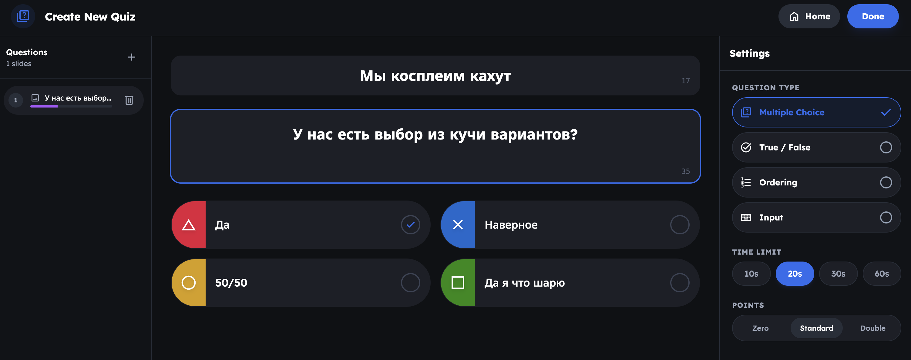
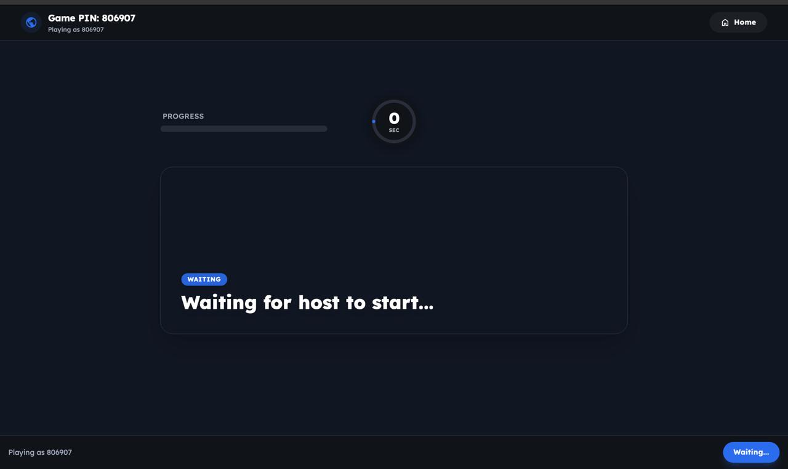
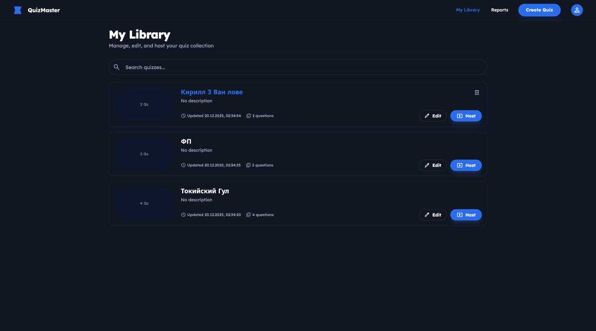
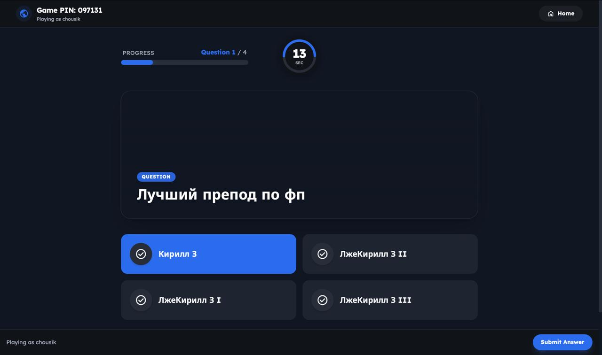

# Квиз‑платформа (Elixir + React)

## Требования и возможности
- Elixir 1.14+, Phoenix 1.7, PostgreSQL.
- JWT‑аутентификация, регистрация/логин.
- CRUD квизов с вопросами и вариантами ответов.
- Создание игровой сессии с уникальным PIN, подключение игроков, подсчет очков и лидерборды в реальном времени.
- WebSocket‑канал (Phoenix Channel) для синхронизации хоста и игроков.
- Frontend на React + Vite с роутингом (Dashboard, Library, Quiz Builder, Host/Player/Join экраны) и подключением к Phoenix Channels.
- Читаемые именованные функции и типичные для OTP паттерны заменяют избыточные пояснения.

## Архитектура и ключевой алгоритм (backend)
- `Quiz.GameServer` — GenServer на один PIN; хранит состояние игры (фаза, активный вопрос, таймер, игроки, ответы) и отвечает за переходы фаз.
- `Quiz.GameSupervisor` (DynamicSupervisor) + `Registry` — динамически поднимают и адресуют игровые процессы по PIN (`{:via, Registry, {Quiz.GameRegistry, pin}}`).
- Поток запуска игры:
  1. `Games.create_session/3` создает `GameSession` c PIN и стартует `GameServer`.
  2. Игроки подключаются к Channel `game:<pin>`; `GameChannel` через `join/3` регистрирует игрока (`SessionPlayer`) или резюмирует по `player_token`.
  3. Хост вызывает `host_start` → `GameServer.start_question/2` выставляет таймер, рассылает вопрос.
  4. Игроки шлют `submit_answer` → GenServer нормализует payload, проверяет дедлайн, начисляет очки по формуле «база + скорость».
  5. По таймеру или нажатию `next_question` ответы фиксируются (`SessionAnswer`), лидерборд транслируется, фаза меняется.
  6. После последнего вопроса `finish_game/1` помечает сессию завершенной и публикует итоговый лидерборд.
- Состояние частично сохраняется в БД (`GameSession.state`, `state_version`) для восстановления после рестартов.

## Ввод/вывод (API)
- REST (JSON), префикс `/api`:
  - `POST /api/auth/register` — email, password, name → `{token, user}`.
  - `POST /api/auth/login` — email, password → `{token, user}`.
  - `GET /api/quizzes` — список квизов владельца.
  - `POST /api/quizzes` — создание квиза с вложенными вопросами/вариантами.
  - `GET /api/quizzes/:id`, `PUT /api/quizzes/:id`, `DELETE /api/quizzes/:id`.
  - `POST /api/games` — создание сессии по `quiz_id`, опциональные настройки → `{pin, ...}`.
- WebSocket (Phoenix Channels):
  - Топик `game:<pin>`.
  - Входящие: `host_start`, `next_question` (только хост), `submit_answer` (игрок).
  - Исходящие: `question_started`, `question_reveal`, `game_finished`, `player_joined`, `player_left`.
- Данные/хранилище: миграции в `backend/priv/repo/migrations`; основные таблицы `users`, `quizzes/questions/choices`, `game_sessions`, `session_players`, `session_answers`.

## Запуск
1. Backend:
   ```bash
   cd backend
   mix deps.get
   MIX_ENV=dev mix ecto.setup
   mix phx.server
   ```
2. Frontend:
   ```bash
   cd frontend
   npm install
   npm run dev
   ```
3. Конфигурация БД задается в `backend/config/dev.exs`;

## Фронтенд
- React + React Router, Vite, Tailwind.
- Подключение к Phoenix Channels через клиент `hooks/useGameChannel.ts` и `phoenix` npm‑пакет.
- Страницы: Dashboard/Library/Discover, Quiz Builder, Host/Player/Join, Reports.
- Хранение сессии и токена — в `state/session.tsx` с простым провайдером.

## Реализация и принципы
- Лаконичность вместо комментариев: функции именованы по домену (`ensure_before_deadline`, `calculate_points`, `persist_session_state`), что уменьшает потребность в пояснениях.
- OTP‑подход: изоляция игры в отдельном процессе, восстановление через сохраненное состояние.
- Явное нормализованное API: контроллеры приводят входные поля к нужному формату (`normalize_questions/1`, `normalize_answer_payload/1`).
- Простая модель авторизации: JWT + plug `QuizWeb.Plugs.Auth` для защищенных маршрутов.

## Выводы 
- OTP‑процессы и Registry позволяют элегантно масштабировать игры по PIN без глобальных ETS/кастомных менеджеров.
- Хранение версионированного состояния в БД снижает риск потери игры при рестарте, оставаясь совместимым с stateless фронтом.
- Сложная логика (таймеры, начисление очков) вынесена в отдельные функции.
- Phoenix Channels дают стабильный real‑time API; на фронте достаточно тонкого клиента без сложного state‑менеджера.

## Немного фоточек
- 
- 
- 
- 
- 
